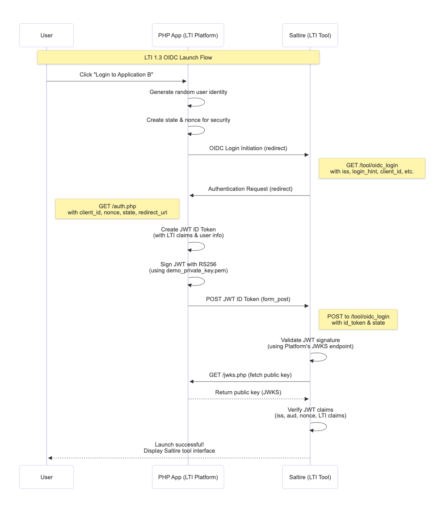
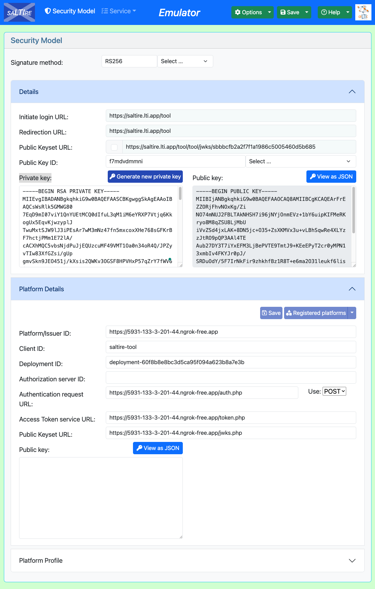

# PHP LTI 1.3 Platform - Saltire Integration

A simple PHP implementation of an LTI 1.3 Platform that launches to the Saltire testing tool.

## 🚀 Quick Start

1. **Clone and Setup**
   ```bash
   # Copy files to your web server
   # Ensure PHP OpenSSL extension is enabled
   ```

2. **Configure Platform**
   - Edit `config.php` with your domain
   - RSA keys auto-generate on first run

3. **Register with Saltire**
   - Go to https://saltire.lti.app/tool
   - Add Platform with these values:
     - **Platform Issuer**: `https://your-domain.com`
     - **Client ID**: `saltire-tool`
     - **Auth URL**: `https://your-domain.com/auth.php`
     - **JWKS URL**: `https://your-domain.com/jwks.php`

4. **Test Launch**
   - Visit `index.php`
   - Click "Login to LEAF"
   - Should launch to Saltire successfully

## 📋 LTI 1.3 Flow



## 🔧 Key Files

- **`index.php`** - Main page with launch button
- **`config.php`** - Platform configuration
- **`auth.php`** - Authentication endpoint (creates JWT)
- **`jwks.php`** - Public key endpoint
- **`launch.php`** - Success confirmation page

## 🔒 Security

- RSA keys auto-generated in `demo_private_key.pem`
- JWT tokens signed with RS256
- State/nonce validation included
- HTTPS required for production

## 🎯 For Your Platform

To integrate into your existing platform:

1. **Copy the JWT creation logic** from `auth.php`
2. **Add JWKS endpoint** from `jwks.php`
3. **Replace user simulation** with your real user data
4. **Update configuration** in `config.php`

## 📚 LTI 1.3 Resources

- [IMS LTI 1.3 Specification](https://www.imsglobal.org/spec/lti/v1p3/)
- [Saltire Testing Tool](https://saltire.lti.app/)

## Saltire configurations


---

**Note**: This is a demo implementation. For production use, consider using established libraries like [LTI-PHP](https://github.com/celtic-project/LTI-PHP).
